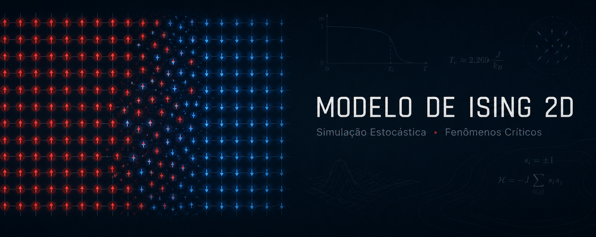
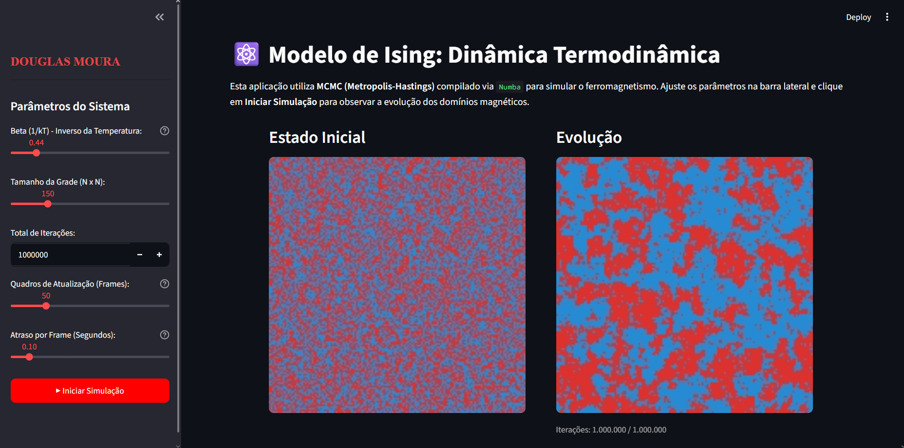

<a name="topo"></a>

<p align="center">
  
</p>

<h1 align="center">🧪 Modelo de Ising 2D: Simulação Estocástica e Fenômenos Críticos</h1>

<p align="center">
  <a href="https://douglasmoura-ising-2d.streamlit.app/"></a>
  <a href="#"></a>
  <a href="#"></a>
  <a href="#"></a>
  <a href="https://douglas-moura-portfolio.pages.dev"></a>
</p>

Este repositório é dedicado à modelagem computacional e simulação estatística do **Modelo de Ising Bidimensional**, um dos paradigmas mais fundamentais da Mecânica Estatística para o estudo de fenômenos coletivos, magnetismo espontâneo e transições de fase de segunda ordem. 

O projeto combina o rigor físico-matemático com a interatividade moderna, fornecendo uma aplicação visual de alta performance desenvolvida em **Python (Streamlit)** acelerada via compilação JIT (**Numba**), além de rotinas complementares de validação estatística desenvolvidas em **R**.

---

## 🚀 Atalhos Rápidos

* 🌐 **[Acesse a Simulação Interativa (Streamlit Cloud)](https://douglasmoura-ising-2d.streamlit.app/)**
* 📓 **[Leia o Relatório Técnico Completo (PDF)](./Relatório%20Modelo%20Ising%202D.pdf)**
* 💼 **[Visite o Case Completo no meu Portfólio](https://douglas-moura-portfolio.pages.dev)**

---

## 📸 Demonstração da Aplicação



*Interface da aplicação Streamlit: o painel esquerdo apresenta a configuração inicial aleatória (temperatura infinita) e o painel direito exibe a evolução termodinâmica e a formação de domínios magnéticos após a termalização próximo à temperatura crítica* ($T_c \approx 2,269 \frac{J}{k_B}$).

---

## ⚛️ Fundamentação Teórica

O sistema consiste em uma rede quadrada de dimensão $n \times n$ com $N = n^2$ sítios. Cada sítio abriga uma variável aleatória chamada *spin* ($\sigma_i \in \{-1, +1\}$), orientada para cima ($\uparrow$) ou para baixo ($\downarrow$). 

A energia total associada a uma configuração $\sigma$ é governada pela Hamiltoniana do modelo:

$$H(\sigma) = -J \sum_{\langle i,j \rangle} \sigma_i \sigma_j - h \sum_i \sigma_i$$

Onde:
* $J$ representa a constante de acoplamento entre vizinhos mais próximos ($J > 0$ define o comportamento ferromagnético).
* $\langle i,j \rangle$ indica que a soma é realizada sobre pares de spins adjacentes.
* $h$ representa o campo magnético externo aplicado.

A transição de fase ferromagnética ocorre na temperatura crítica de Curie ($T_c$, com $h=0$). No limite termodinâmico, o valor crítico do parâmetro de acoplamento térmico $\beta = \frac{1}{k_B T}$ foi solucionado analiticamente de forma exata por **Lars Onsager (1944)**:

$$\beta_c = \frac{\ln(1+\sqrt{2})}{2J} \approx 0,4407$$

Abaixo dessa temperatura ($\beta > \beta_c$), as interações ferromagnéticas locais dominam, fazendo surgir uma magnetização espontânea global ($M > 0$). Acima dela ($\beta < \beta_c$), a desordem térmica supera o acoplamento, restaurando a simetria de fase paramagnética ($M = 0$).

---

## ⚡ Engenharia de Performance e Arquitetura

Para viabilizar simulações de grades extensas em tempo real com milhões de iterações por segundo diretamente no navegador, o motor computacional do projeto foi otimizado a nível de hardware utilizando três pilares:

### 1. Compilação *Just-In-Time* (JIT) via Numba
O gargalo tradicional de loops de amostragem estocástica (como laços `for` em Python) foi superado decorando o algoritmo de atualização com `@njit`. Isso converte o código em instruções binárias nativas de CPU via LLVM, eliminando o overhead do interpretador CPython e contornando as limitações do GIL (*Global Interpreter Lock*):

```python
@njit
def metropolis_hastings_step(grid: np.ndarray, beta: float, n_steps: int) -> np.ndarray:
    n = grid.shape[0]
    for _ in range(n_steps):
        # Seleção uniforme aleatória de um sítio
        i = np.random.randint(0, n)
        j = np.random.randint(0, n)
        
        # Condições de contorno periódicas usando aritmética modular
        soma_vizinhos = (
            grid[(i - 1) % n, j] + 
            grid[(i + 1) % n, j] + 
            grid[i, (j - 1) % n] + 
            grid[i, (j + 1) % n]
        )
        
        # Variação de energia (ΔE) na inversão do spin
        de = 2 * grid[i, j] * soma_vizinhos
        
        # Critério de Aceitação de Metropolis-Hastings
        if de <= 0 or np.random.rand() < np.exp(-beta * de):
            grid[i, j] *= -1 # Inverte o spin
            
    return grid
```

### 2. Condições de Contorno Aritméticas (Toro 2D)
A validação das fronteiras periódicas foi projetada utilizando aritmética escalar modular (como `(i - 1) % n`). Essa estratégia evita ramificações lógicas condicionais (`if-else`), que forçam desvios lógicos no pipeline da CPU (*branch mispredictions*), mantendo a pipeline de instruções livre de gargalos.

### 3. Vetorização da Renderização Gráfica
Bibliotecas de plotagem tradicionais constroem objetos gráficos complexos a cada iteração, sobrecarregando o processador. A renderização visual foi vetorizada mapeando diretamente a matriz de spins para um tensor de três canais (RGB uint8) usando indexação booleana (*masking*) rápida via NumPy, que é ejetada diretamente para a interface visual do Streamlit:

```python
def render_grid_to_rgb(grid: np.ndarray) -> np.ndarray:
    # Cria o tensor RGB vazio (H, W, 3)
    rgb_img = np.zeros((grid.shape[0], grid.shape[1], 3), dtype=np.uint8)
    
    # Aplica cores vetorialmente O(1): Vermelho para +1 (Up), Azul para -1 (Down)
    rgb_img[grid == 1] = [220, 50, 47]   
    rgb_img[grid == -1] = [38, 139, 210] 
    return rgb_img
```

---

## 📂 Estrutura do Repositório

```text
├── README.md                            # Apresentação e documentação do repositório
├── requirements.txt                     # Pacotes e dependências Python para execução
├── app_ising.py                         # Código-fonte principal da aplicação Streamlit
├── app_ising_demo.png                   # Captura de tela para demonstração visual
├── modelo_ising.R                       # Script R
└── Relatório Modelo Ising 2D.pdf        # Relatório técnico-teórico completo (padrão ABNT)
```

---

## 💻 Como Executar a Aplicação Localmente

### Pré-requisitos
Certifique-se de ter o Python 3.8+ instalado em sua máquina.

### 1. Clonar e Acessar o Repositório
```bash
git clone https://github.com/douglascmoura/modelo_ising_2d_metropolis.git
cd modelo_ising_2d_metropolis
```

### 2. Configurar o Ambiente Virtual (Recomendado)
* No Windows:
  ```bash
  python -m venv venv
  .\venv\Scripts\activate
  ```
* No Linux/MacOS:
  ```bash
  python3 -m venv venv
  source venv/bin/activate
  ```

### 3. Instalar Dependências e Executar
```bash
# Instalação das bibliotecas compiladoras e visuais
pip install -r requirements.txt

# Inicialização da interface interativa local
streamlit run app_ising.py
```

---

## 📖 Relatório Técnico Avançado (`Relatório Modelo Ising 2D.pdf`)

Substituindo o antigo rascunho simplificado, o novo relatório técnico incorporado neste repositório fornece uma análise físico-matemática exaustiva do sistema. Dentre os tópicos fundamentais, destacam-se:

* **Balanço Detalhado e Ergodicidade:** Demonstração formal de como a decomposição de propostas simétricas e probabilidades de aceitação no critério de Metropolis satisfazem a equação de balanço detalhado, garantindo a convergência da distribuição empírica para a distribuição estacionária de Gibbs.
* **Grandezas Observáveis Termodinâmicas:** Equações de flutuação-dissipação para cálculo da magnetização espontânea, suscetibilidade magnética ($\chi$) e calor específico ($C$).
* **Desaceleramento Crítico (*Critical Slowing Down*):** Discussão teórica da divergência de tempo de autocorrelação integrado ($\tau_{\text{int}} \sim |T - T_c|^{-z\nu}$) próximo ao ponto crítico e as limitações de atualizações locais de spins.
* **Invariância de Escala e Emergência Fractal:** Análise geométrica do contorno de domínios no ponto crítico, exibindo dimensão fractal analítica de $D_f = 1,375$ (Evolução de Schramm-Loewner).

---

## ✍🏽 Autor

<table align="center">
  <tr>
    <td align="center" width="150px">
      <br />
      <sub><b>Douglas Chaves Moura</b></sub>
    </td>
    <td>
      <p>Desenvolvedor e pesquisador idealizador deste projeto sob a identidade <b>DOCHMO</b>. Focado na aplicação prática de métodos computacionais para problemas de Física Estatística, modelagem estocástica e simulações científicas de alta performance.</p>
      <p align="left">
        <a href="https://github.com/douglascmoura"></a>
        <a href="https://www.linkedin.com/in/douglas-chaves-moura/"></a>
        <a href="mailto:douglascmoura21@gmail.com"></a>
        <a href="https://douglas-moura-portfolio.pages.dev/"></a>
      </p>
    </td>
  </tr>
</table>

<p align="right"><a href="#topo">🔼 Voltar ao topo</a></p>
